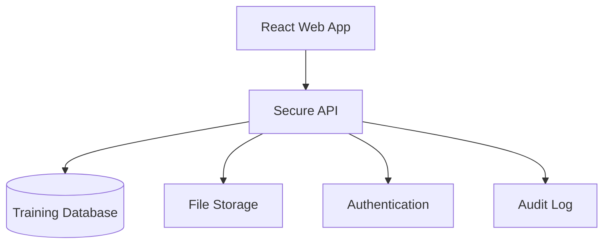

# مراجعة وتطوير منصة Cath Lab Academy

## الملخص التنفيذي

المشروع مناسب كنموذج أولي متقدم لعرض فكرة المنصة وتجربة المسارات التعليمية. البنية خفيفة وسهلة التشغيل، لكن النسخة الحالية ما زالت Frontend فقط؛ لا توجد حسابات حقيقية أو قاعدة بيانات أو اعتماد مدرب أو رفع ملفات.

## البنية الحالية

- React 18 مع Vite 7.
- صفحتان مستقلتان: الصفحة الرئيسية وصفحة معلومات برنامج الدبلوم.
- محتوى عربي وإنجليزي داخل ملفات JavaScript.
- تخزين التقدم وإجابات المحاكاة محليًا باستخدام `localStorage`.
- بناء متعدد الصفحات من خلال إعداد Rollup في `vite.config.js`.
- لا توجد بيانات مرضى أو اتصال بأنظمة المستشفى في هذه النسخة.

## التحسينات المنفذة في هذا الإصدار

- إصلاح حفظ اللغة بين الصفحة الرئيسية وصفحة البرنامج مع التوافق مع البيانات المحفوظة من الإصدار السابق.
- استبدال نسب لوحة المتابعة الافتراضية بأرقام فعلية محسوبة من نشاط المستخدم.
- ربط جاهزية الشهادة بإكمال جميع الكفاءات واجتياز جميع سيناريوهات المحاكاة.
- إضافة إعادة ضبط واضحة للتقدم المحلي.
- تحسين قائمة التنقل للجوال وإضافة دعم لوحة المفاتيح وقارئ الشاشة وحالات التركيز.
- توضيح أن تسجيل الدخول غير متصل وتعطيل الحقول الوهمية حتى يتم توفير Backend آمن.
- جعل الروابط بين الصفحتين نسبية لتعمل في التشغيل المحلي والاستضافات ذات المسارات الفرعية.
- إضافة أمر فحص موحد وتعليمات تشغيل عربية مخصصة لـ Windows والجوال.

## ملاحظات المخاطر والجودة

- محتوى الدبلوم والسيناريوهات السريرية يحتاج اعتمادًا رسميًا من التعليم السريري والحوكمة قبل الاستخدام داخل المنشأة.
- التخزين المحلي غير مناسب لسجلات الموظفين الرسمية، لأنه غير مشفر وغير متزامن ويمكن مسحه من المتصفح.
- طباعة الشهادة الحالية لا تمثل اعتمادًا رسميًا ولا تتضمن رقم تحقق أو توقيع مدرب موثق.
- نموذج القلب الحالي توضيحي بصريًا وليس نموذجًا تشريحيًا ثلاثي الأبعاد معتمدًا.
- لا توجد اختبارات آلية للواجهة حتى الآن؛ فحص البناء يضمن سلامة التجميع فقط.

## التطوير المقترح بالترتيب

### 1. منصة مستخدمين حقيقية

- مصادقة آمنة مع أدوار `trainee` و`trainer` و`admin`.
- قاعدة بيانات للمتدربين والدورات والكفاءات والمحاولات.
- صلاحيات دقيقة تمنع المتدرب من اعتماد كفاءته بنفسه.
- سجل تدقيق لكل تعديل واعتماد.

### 2. إدارة المحتوى التعليمي

- Course Builder لإضافة الدروس والفيديوهات والملفات والاختبارات دون تعديل الكود.
- تخزين الملفات في Object Storage مع قيود للنوع والحجم وفحص أمني.
- حالة للمحتوى: مسودة، قيد المراجعة، معتمد، مؤرشف.
- رقم إصدار وتاريخ مراجعة ومالك سريري لكل درس.

### 3. التقييم واعتماد المدرب

- DOPS وMini-CEX وProcedure Logbook حسب الدور.
- توقيع إلكتروني للمدرب وتعليقات وخطة تحسين.
- معايير نجاح قابلة للضبط بدل الشروط الثابتة داخل الواجهة.
- شهادة PDF برقم تحقق وQR بعد الاعتماد النهائي فقط.

### 4. الحوكمة والأمان

- سياسة خصوصية واحتفاظ بالبيانات متوافقة مع متطلبات المنشأة وPDPL.
- عدم إدخال أي بيانات مرضى في المنصة التعليمية.
- نسخ احتياطي، مراقبة أخطاء، وسجل نشاط إداري.
- مراجعة دورية للمحتوى مقابل سياسات المستشفى والمراجع المعتمدة.

### 5. التجربة المتقدمة

- Dashboard حقيقي للمدرب حسب الفريق والمسار والفترة الزمنية.
- نموذج قلب GLB موثق، ثم WebXR/AR كمرحلة مستقلة بعد نجاح المنصة الأساسية.
- تكامل LMS لاحقًا باستخدام SCORM أو xAPI عند تحديد نظام المنشأة.

## البنية المستهدفة

الأولوية الصحيحة هي بناء الحسابات والبيانات واعتماد المدرب أولًا، ثم إضافة رفع المحتوى، وبعد استقرارها تبدأ مرحلة 3D وAR/VR.
